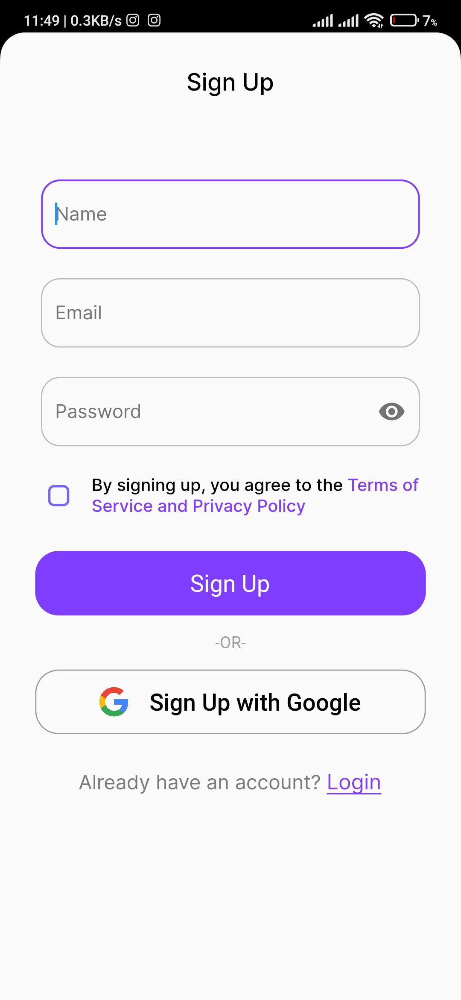
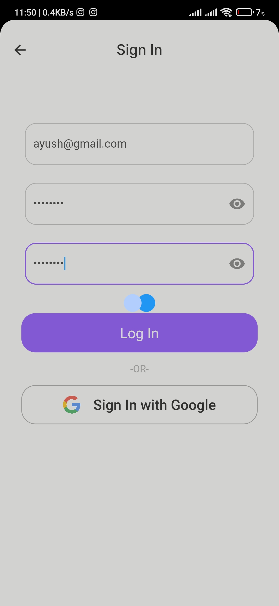
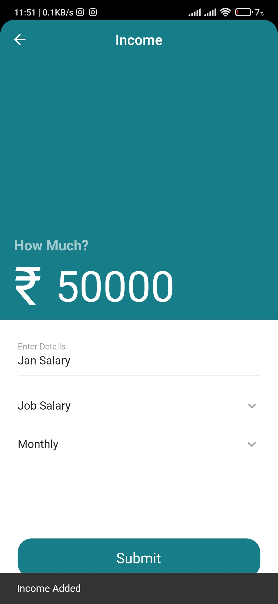
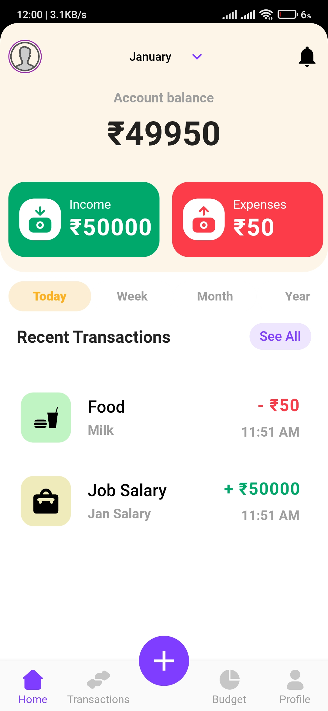
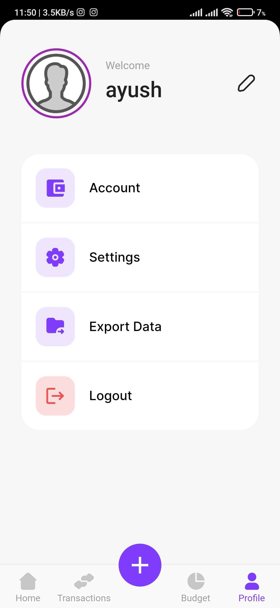
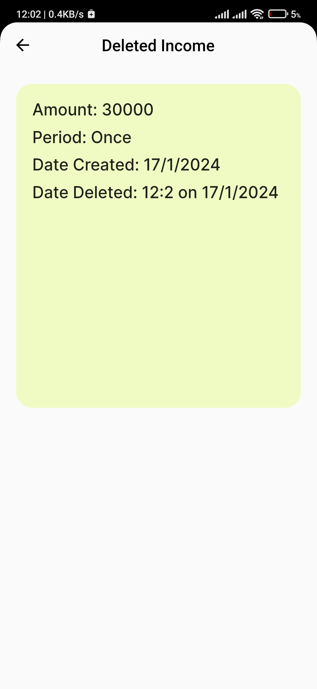
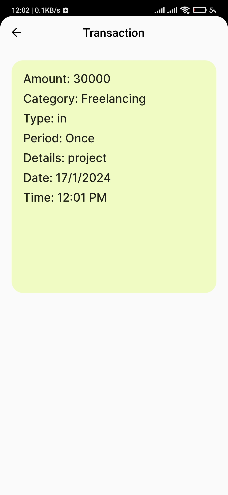

# [APK FILE](https://github.com/akshatt25/CipherSchools-Flutter-Assignment/blob/main/assignment/app-release.apk)
# expense_tracker

# Functionalities 
- User Authentication with suitable exception/error handling (User already exists, Invalid Credentials, Email & Password validation)
- Detailed UI and Animations. (Icons, Scroll & Swipe Animation)
- Deletion of Income/Expense by Swipe, A deleted transaction entry is added.
- Income, Expense, Transactions & Deleted Transactions can be viewed by clicking on Tile from List View.
- Transactions are permament and can't be deleted to maintain consistency
- User can log out from profile screen
- Budget Screen shows Incomes and Expenses in list view and they can be deleted from there by swiping.
- The functionalities are smooth - adding, deleting, viewing
- Date & Time details are saved for each transaction
- Used Provider for state management
- Used SqfLite for local storage
- Used Shared prefs to store Uid, Total Income, Total Expense
- All Transactions can be viewed from Transactions screen
- Income and Expense can be added by clicking the floating + button or by taping on Income-Green Box and Expense- Red Box on Home Screen

  # Please view all screenshots and screen recordings [Here](assignment/screenshots)

-Android >=12 splash screen enlagres the icon,
# Screenshots
|  |  |

